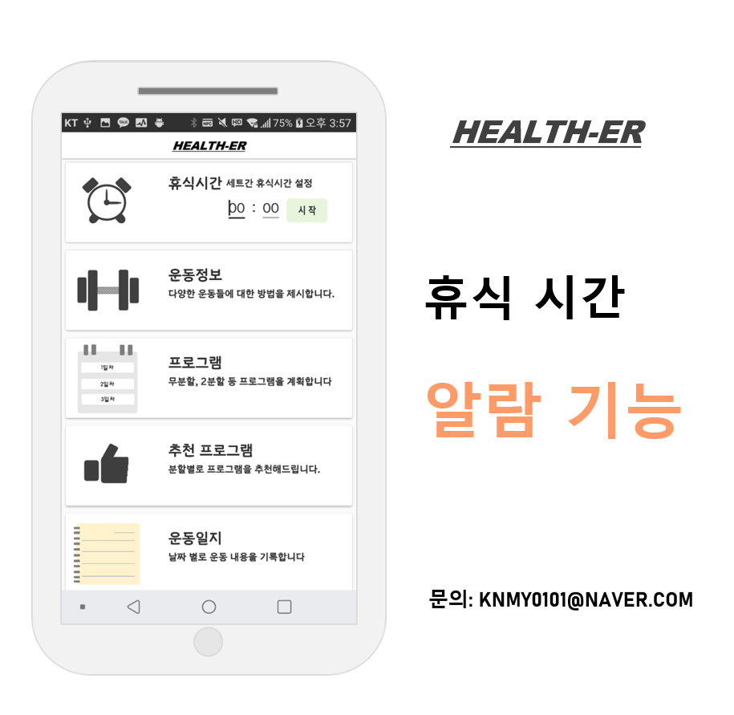
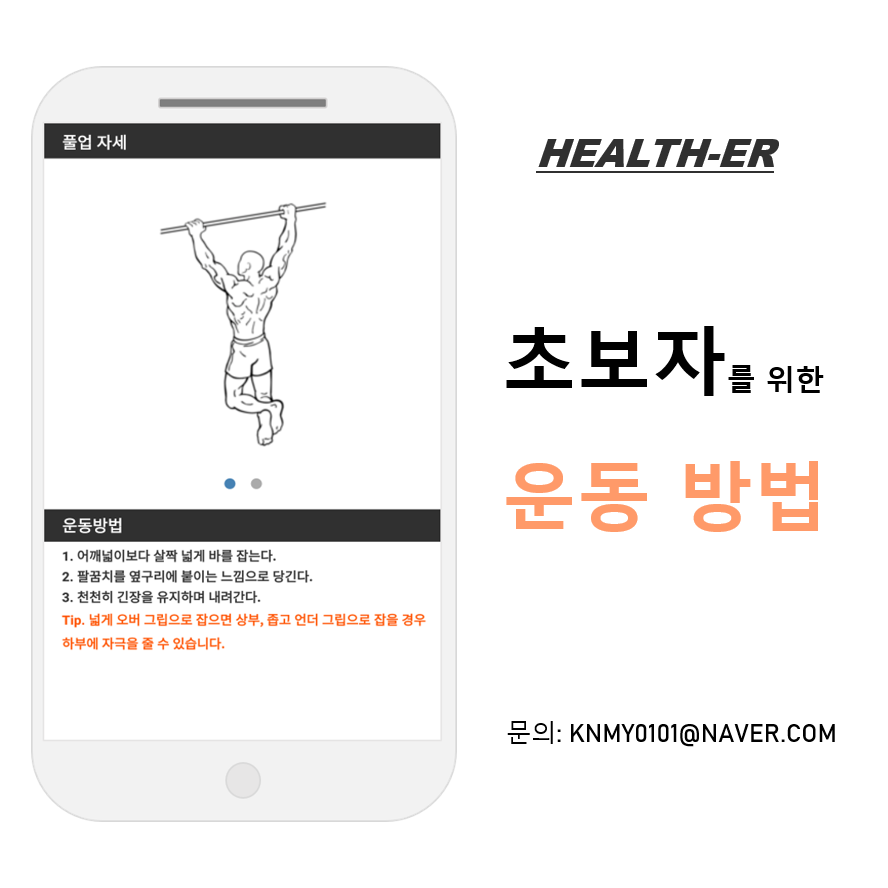
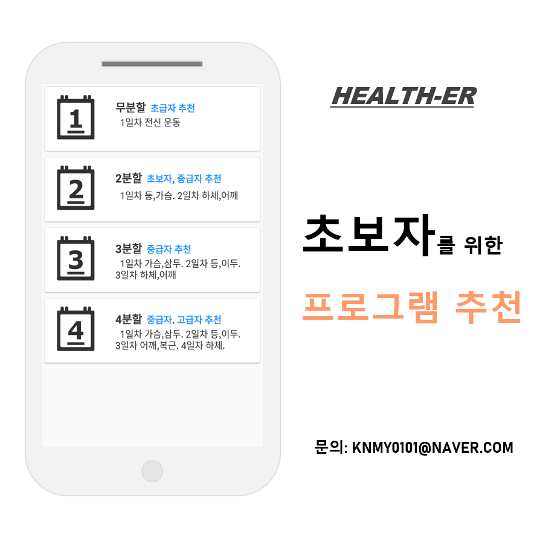
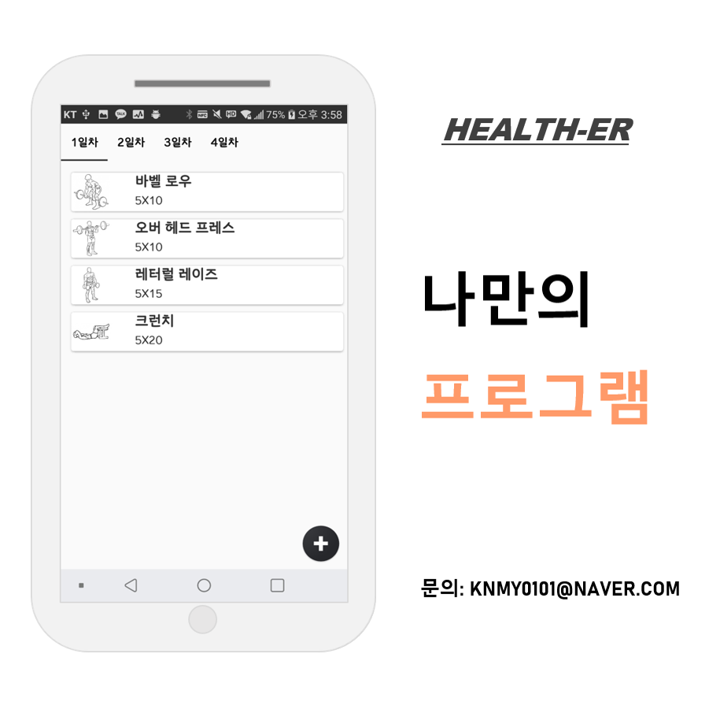
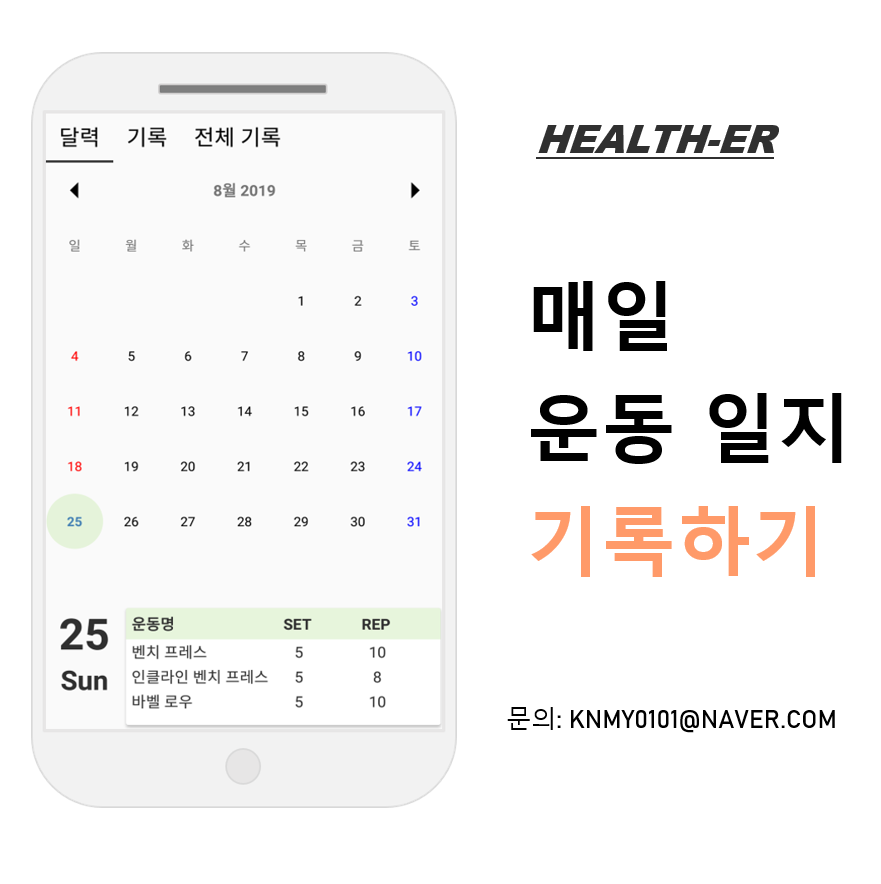
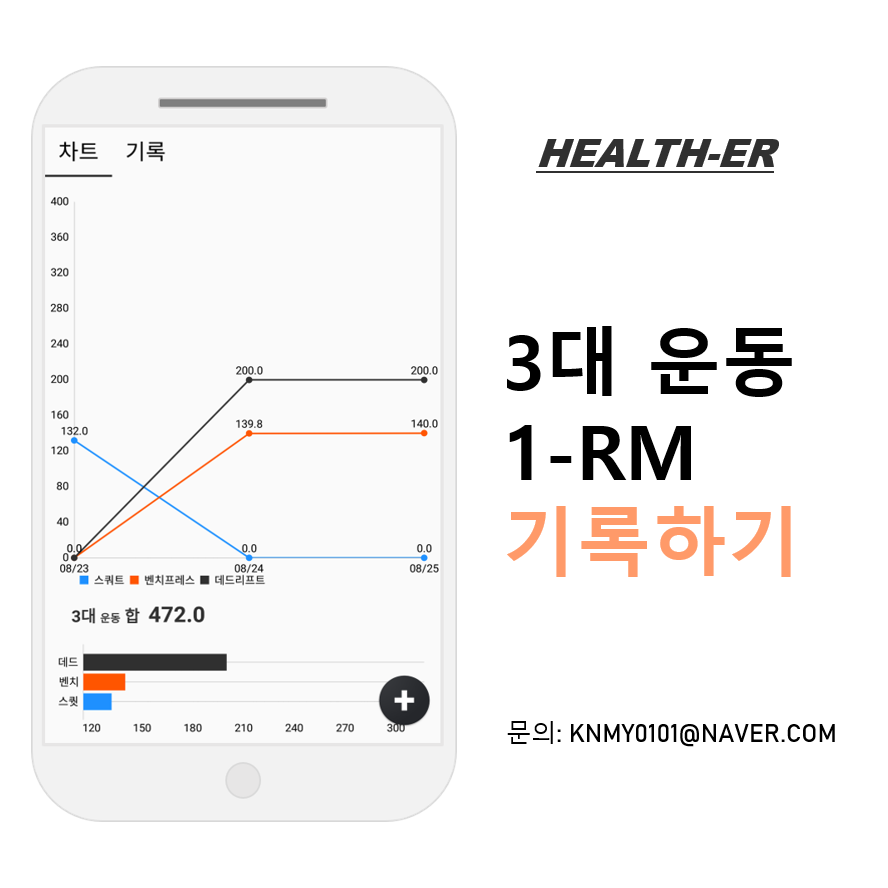
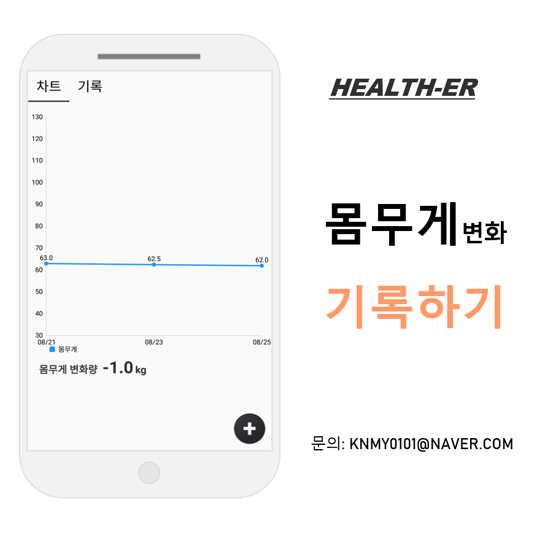

## HEALTH-ER
 🏋 Weight training guide application.
 
## 2020.11.02 ~ 리팩토링 진행 중
 
 </img> 
 ### Download: [playstore][link]
 ***
 
 ### STACK 📚
 - Android(Java, Kotlin)  
 - SQLite, Room
 - MVVM
 - Android Architecture Component(LiveData, Databinding)
 - [MPAndroidChart][link]  
 - [material-calendarview][link]
 
 ### Main Function
 #### 0. Alarm(break time)
 Set a break time
 
 </img>
 
 #### 1. Exercise method
 Know how to perform a exercise
 
 </img>

 
 #### 2. Recommend Program
 Recommend basic program
 
 </img>

 #### 3. Custorm Program
 Make a custom program
 
 </img>

 #### 4. Exercise Record
 Record your workouts
 
 </img>

 #### 5. 1-RM Record
 Record your Bench press, Squat, Deadlift
 
 </img>

 #### 6. Bodyweight Record
 Record your bodyweight everyday
 
 </img>
 
 ### License
GNU GENERAL PUBLIC LICENSE
Version 3, 29 June 2007
Copyright (C) 2007 Free Software Foundation, Inc. <https://fsf.org/>
Everyone is permitted to copy and distribute verbatim copies
of this license document, but changing it is not allowed.

[link]: https://play.google.com/store/apps/details?id=com.health.myapplication "Download"
[MPAndroidChart]: https://github.com/PhilJay/MPAndroidChart "MPAndroidChart"
[material-calendarview]: https://github.com/prolificinteractive/material-calendarview
